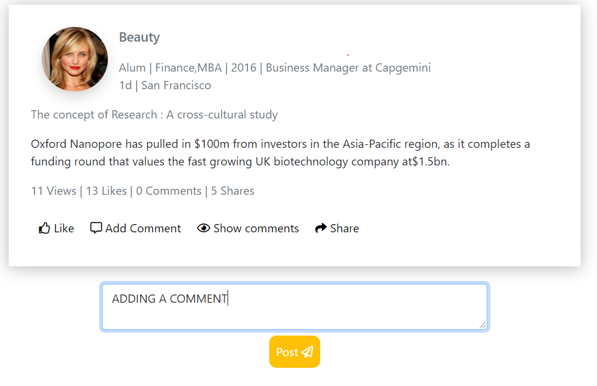

### Softwares to be installed:
- IDE like VS-code
- My SQL Community
- NodeJS

Unzipped file contains a folder named  Project_UnPlatforms-master and in that two  folders frontend and backend

### Installing Dependencies:
Now to Install dependencies in both frontend and backend folder to run our react-app
- Change the working directory to frontend in IDE and run `npm install`
- Change the working directory to backend in IDE and run `npm install`

# Configurations:
#### Configuring sequelize:
Navigate to backend\config and open config.json
```
{
  "development": {
    "username": "....",
    "password": "....",
    "database": "....",
    "host": "127.0.0.1",
    "dialect": "mysql"
  },
  "test": {...},
  "production": {...}
}
```

Change the development object properties.
- set `username`  to the username of My SQL Instance
-  set `password`  to the password of My SQL Instance
- set `database` to the database name of your My SQL Instance

### Running the Express Server:
To run the express server:  
- navigate to `backend` folder, in the command prompt any IDE terminal
- run `nodemon server` to run express server
### Running react-app:
To run the react-app
- navigate to `frontend` folder, in command prompt or any IDE terminal
- run `npm start` to run react-app

### Features:
- Added functionality for likes, shares and views
#### Comments:
The app features functioning comments




